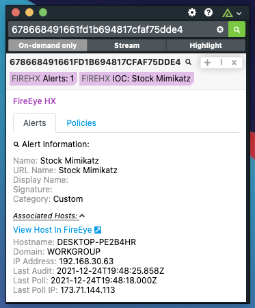

# Polarity Trellix (prev. FireEye) HX Integration

The Trellix Endpoint Security protects your organization with intelligence led protection, detection and response.

Polarity's Trellix HX integration allows querying for Alerts, Associated Hosts, and Policy data using Hashes.

To learn more about Trellix HX, visit the [official website](https://www.trellix.com/en-us/products/endpoint-security-hx.html).

## Trellix HX Integration Options

### Trellix HX Instance URL

The URL of the Trellix HX instance you would like to connect to (including http:// or https://)

### Trellix HX API Token

The API Token associated with the Trellix HX account.

### Max Concurrent Search Requests

Maximum number of concurrent search requests (defaults to 20). Integration must be restarted after changing this option.

### Minimum Time Between Searches

Minimum amount of time in milliseconds between each entity search (defaults to 100). Integration must be restarted after changing this option.

## Installation Instructions

Installation instructions for integrations are provided on the [PolarityIO GitHub Page](https://polarityio.github.io/).

## Polarity

Polarity is a memory-augmentation platform that improves and accelerates analyst decision making. For more information about the Polarity platform please see:

https://polarity.io/
